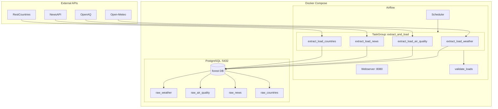

# Architecture — Forest eBikes London Data Pipeline

## Local vs Cloud: Comparison

| Dimension | Local | Cloud |
|---|---|---|
| Orchestration | Apache Airflow (Docker) | Cloud Composer 2 (managed Airflow) |
| Compute | Docker containers on dev machine | Cloud Functions Gen 2 (serverless) |
| Data warehouse | PostgreSQL 15 | BigQuery |
| Transformation | Raw tables only | dbt (staging + marts via Cloud Run Job) |
| Deduplication | `INSERT … ON CONFLICT DO NOTHING` | `MERGE` statement in BigQuery |
| Secret management | `.env` file | GCP Secret Manager |
| Infrastructure | `docker compose up` | Terraform (modular) |
| Cost | Free (local resources) | ~$50–80/month (see estimate below) |
| Scalability | Limited by local hardware | Auto-scales to any volume |

---

## Local Architecture



---

## Cloud Architecture

```mermaid
flowchart TD
    subgraph External APIs
        A1[Open-Meteo]
        A2[OpenAQ]
        A3[NewsAPI]
        A4[RestCountries]
    end

    subgraph GCP europe-west2
        subgraph Cloud Composer 2
            DAG[forest_pipeline_cloud DAG]
        end

        subgraph Cloud Functions Gen 2
            F1[fn-extract-weather]
            F2[fn-extract-airquality]
            F3[fn-extract-news]
            F4[fn-extract-countries]
        end

        SM[Secret Manager\nnews-api-key]

        subgraph BigQuery
            subgraph raw dataset
                BW[raw_weather]
                BA[raw_air_quality]
                BN[raw_news]
                BC[raw_countries]
            end
            subgraph mart dataset
                M1[mart_city_conditions]
                M2[mart_news_enriched]
            end
        end

        CR[Cloud Run Job\ndbt-run]
        TF[Terraform]
    end

    TF -.provisions.-> Cloud Composer 2
    TF -.provisions.-> Cloud Functions Gen 2
    TF -.provisions.-> BigQuery
    TF -.provisions.-> CR
    TF -.provisions.-> SM

    DAG --> F1 & F2 & F3 & F4
    SM --> F3

    A1 --> F1 --> BW
    A2 --> F2 --> BA
    A3 --> F3 --> BN
    A4 --> F4 --> BC

    DAG --> CR
    BW & BA & BN & BC --> CR
    CR --> M1 & M2

    DAG --> CHECK{BigQueryCheckOperator\nvalidate_bq}
    BW --> CHECK
```

---

## Data Lineage

```
APIs (raw JSON)
    │
    ▼
raw layer  (PostgreSQL / BigQuery raw dataset)
    raw_weather       ── partitioned by ingested_at (BQ)
    raw_air_quality   ── partitioned by ingested_at (BQ)
    raw_news          ── partitioned by ingested_at (BQ)
    raw_countries     ── partitioned by ingested_at (BQ)
    │
    ▼  dbt staging (views)
    stg_weather       ── type casts, weathercode → weather_description
    stg_air_quality   ── filter value < 0, type casts
    stg_news          ── is_recent flag, type casts
    stg_countries     ── type casts
    │
    ▼  dbt marts (tables)
    mart_city_conditions  ── daily agg: weather JOIN air_quality
    mart_news_enriched    ── recent news CROSS JOIN countries (static enrichment)
```

---

## Scalability Considerations (10× data volume)

| Concern | Current | At 10× |
|---|---|---|
| Ingestion throughput | Single httpx call per extractor | Add pagination + async (`httpx.AsyncClient`) |
| Deduplication | `ON CONFLICT DO NOTHING` / `MERGE` | Already set-based; no change needed |
| BQ partitioning | Daily on `ingested_at` | Add clustering on `location_city` / `parameter` |
| Airflow tasks | One task per API | Split into extract → load tasks; use sensors for fan-out |
| Cloud Functions memory | 256 MB | Scale to 512 MB; or move to Cloud Run for long-running jobs |
| dbt models | Views + tables | Incremental models on `ingested_at` to avoid full rebuilds |

---

## Cloud Cost Estimate (monthly, London data volume)

| Service | Usage assumption | Est. cost |
|---|---|---|
| Cloud Composer 2 (small) | 1 environment, ~30 DAG runs/month | ~$300 |
| Cloud Functions Gen 2 | 4 functions × 30 invocations × 60 s × 256 MB | ~$1 |
| BigQuery storage | ~1 GB/month raw data | ~$0.02 |
| BigQuery queries | ~100 queries/month (dbt + validation) | ~$0.50 |
| Cloud Run Job (dbt) | 30 jobs × 2 min × 1 vCPU | ~$0.30 |
| Secret Manager | 1 secret, 30 accesses/month | < $0.01 |
| **Total** | | **~$302/month** |

> Composer dominates cost. For smaller teams, running Airflow locally or on a single GCE VM dramatically reduces the bill (~$20–30/month total).
