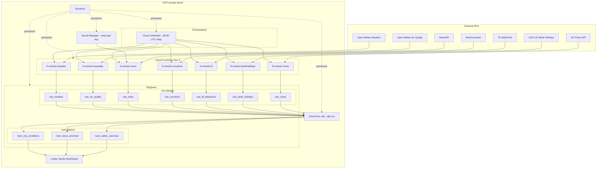

# Architecture — Forest eBikes London Data Pipeline

## Overview

Serverless data pipeline running entirely on GCP. Seven public APIs are ingested daily
into BigQuery via Cloud Functions Gen 2, scheduled by Cloud Scheduler, and visualised
in Looker Studio. Infrastructure is fully managed by Terraform.

---

## Architecture Diagram



---

## Component Breakdown

| Component | Technology | Purpose |
|---|---|---|
| Orchestration | Cloud Scheduler | Triggers each Cloud Function daily at 06:00 UTC |
| Extraction | Cloud Functions Gen 2 (Python 3.11) | One function per API — extract, validate, load |
| Secret management | GCP Secret Manager | NewsAPI key injected at runtime |
| Data warehouse | BigQuery (`raw` + `mart` datasets) | Partitioned raw tables + transformed marts |
| Transformation | dbt via Cloud Run Job | Staging views + mart tables |
| Deduplication | BigQuery `MERGE` statement | Idempotent loads — safe to re-run |
| Visualisation | Looker Studio | Live dashboard connected to BigQuery |
| Infrastructure | Terraform (modular) | Reproducible provisioning of all GCP resources |

---

## Data Sources

| API | Data | Schedule |
|---|---|---|
| Open-Meteo | Hourly weather forecast (temp, wind, weathercode) | Daily |
| Open-Meteo Air Quality | Hourly PM10, PM2.5, NO2, O3 | Daily |
| NewsAPI | Latest articles on London micro-mobility | Daily |
| RestCountries | UK reference data (population, languages, currencies) | Daily (idempotent) |
| TfL BikePoint | ~800 Santander Cycles stations — bike availability snapshot | Daily |
| GOV.UK Bank Holidays | England & Wales / Scotland / N. Ireland holidays | Daily (idempotent) |
| UK Police API | Street-level crime incidents in central London | Daily |

---

## Data Lineage

```
APIs (raw JSON)
    │
    ▼
raw layer  (BigQuery `raw` dataset — partitioned by ingested_at)
    raw_weather          raw_air_quality      raw_news
    raw_countries        raw_tfl_bikepoints   raw_bank_holidays
    raw_crime
    │
    ▼  dbt staging (views)
    stg_weather          ── type casts, weathercode → weather_description
    stg_air_quality      ── filter value < 0
    stg_news             ── is_recent flag (published within 7 days)
    stg_countries        ── type casts
    stg_tfl_bikepoints   ── occupancy_rate = nb_bikes / nb_docks
    stg_bank_holidays    ── parse date, is_england_wales flag
    stg_crime            ── is_resolved, is_bicycle_theft flags
    │
    ▼  dbt marts (tables — partitioned)
    mart_city_conditions   ── daily weather + air quality aggregate
    mart_news_enriched     ── recent news enriched with UK country metadata
    mart_safety_overview   ── monthly crime + TfL availability + bank holiday flag
```

---

## Scalability Considerations

| Concern | Current | At 10× volume |
|---|---|---|
| Ingestion throughput | Single httpx call per function | Add pagination + async httpx |
| Deduplication | BigQuery `MERGE` | Already set-based — no change needed |
| BQ partitioning | Daily on `ingested_at` | Add clustering on `location_city` / `parameter` |
| Cloud Functions memory | 256 MB | Scale to 512 MB or migrate to Cloud Run |
| dbt models | Views + tables | Switch to incremental models on `ingested_at` |
| Scheduling | Cloud Scheduler (per function) | Add retry logic + dead-letter queue via Pub/Sub |

---

## Cloud Cost Estimate (monthly)

| Service | Usage assumption | Est. cost |
|---|---|---|
| Cloud Scheduler | 7 jobs × 30 triggers/month | ~$0.10 |
| Cloud Functions Gen 2 | 7 functions × 30 runs × ~60 s × 256 MB | ~$1.50 |
| BigQuery storage | ~1 GB/month raw data | ~$0.02 |
| BigQuery queries | ~100 queries/month (dbt + ad-hoc) | ~$0.50 |
| Cloud Run Job (dbt) | 30 jobs × 2 min × 1 vCPU | ~$0.30 |
| Secret Manager | 1 secret, 30 accesses/month | < $0.01 |
| Looker Studio | Connected to BigQuery | Free |
| **Total** | | **~$2.50/month** |
