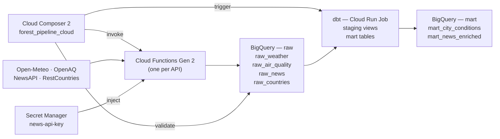

# Forest eBikes — Cloud Data Pipeline

This branch extends the local pipeline to a fully managed GCP stack. Data is
extracted by serverless Cloud Functions, landed in BigQuery, transformed by dbt
running as a Cloud Run Job, and orchestrated end-to-end by Cloud Composer 2.
Infrastructure is provisioned entirely with Terraform, keeping the deployment
reproducible and auditable.

The cloud architecture targets production readiness: secrets live in Secret
Manager, all BigQuery tables are partitioned by ingestion date for cost control,
and dbt MERGE statements ensure idempotent loads without full-table rewrites.

## Architecture



## Prerequisites

- GCP project with billing enabled
- `gcloud` CLI authenticated (`gcloud auth application-default login`)
- Terraform >= 1.6
- Docker (to build and push the dbt image)
- A free NewsAPI key from [newsapi.org](https://newsapi.org)

## Setup & Deploy

**1. Configure Terraform variables**
```bash
cd cloud/terraform/
cp terraform.tfvars.example terraform.tfvars
# Edit terraform.tfvars — set gcp_project_id, news_api_key, dbt_image
```

**2. Build and push the dbt Docker image**
```bash
cd cloud/dbt/
docker build -t europe-west2-docker.pkg.dev/YOUR_PROJECT/forest-pipeline/dbt:latest .
docker push europe-west2-docker.pkg.dev/YOUR_PROJECT/forest-pipeline/dbt:latest
```

**3. Initialise and apply Terraform**
```bash
cd cloud/terraform/
terraform init
terraform plan
terraform apply
```

**4. Upload the DAG to Composer**
```bash
gcloud composer environments storage dags import \
  --environment forest-pipeline \
  --location europe-west2 \
  --source cloud/dags/forest_pipeline_dag.py
```

**5. Set Airflow Variables in Composer**

In the Composer Airflow UI under **Admin → Variables**, create:

| Key | Value |
|---|---|
| `gcp_project_id` | your GCP project ID |
| `gcp_region` | `europe-west2` |
| `fn_weather_name` | `fn-extract-weather` |
| `fn_airquality_name` | `fn-extract-airquality` |
| `fn_news_name` | `fn-extract-news` |
| `fn_countries_name` | `fn-extract-countries` |
| `dbt_cloud_run_job` | `dbt-run` |

## Triggering and Monitoring

**Trigger manually**
```bash
gcloud composer environments run forest-pipeline \
  --location europe-west2 \
  dags trigger -- forest_pipeline_cloud
```

**Monitor via Composer UI**

The Airflow UI URI is printed by Terraform:
```bash
terraform output composer_airflow_uri
```

**Monitor BigQuery**
```sql
SELECT DATE(ingested_at), COUNT(*) as rows
FROM `your-project.raw.raw_weather`
GROUP BY 1
ORDER BY 1 DESC;
```

## Data Model

| Layer | Object | Description |
|---|---|---|
| Raw | `raw.raw_weather` | Hourly forecasts, partitioned by `ingested_at` |
| Raw | `raw.raw_air_quality` | Pollution measurements, partitioned by `ingested_at` |
| Raw | `raw.raw_news` | News articles, partitioned by `ingested_at` |
| Raw | `raw.raw_countries` | UK reference data, partitioned by `ingested_at` |
| Staging | `mart.stg_weather` | Typed + weathercode decoded (view) |
| Staging | `mart.stg_air_quality` | Typed + negative values filtered (view) |
| Staging | `mart.stg_news` | Typed + `is_recent` flag (view) |
| Staging | `mart.stg_countries` | Typed reference (view) |
| Mart | `mart.mart_city_conditions` | Daily weather + AQ aggregates (table, partitioned by date) |
| Mart | `mart.mart_news_enriched` | Recent articles enriched with UK metadata (table) |

## Design Decisions

**Cloud Functions over Cloud Run services**: Each extractor is a short-lived HTTP
call (< 60 s). Cloud Functions Gen 2 provides zero-infrastructure serverless
execution, automatic scaling, and per-invocation billing — ideal for a daily
pipeline with low sustained throughput.

**BigQuery MERGE over streaming inserts**: `MERGE` on a staging temp table gives
exact deduplication semantics matching the local `ON CONFLICT DO NOTHING` strategy,
while keeping the raw tables in an append-friendly partitioned layout.

**dbt as a Cloud Run Job**: dbt is stateless and batch-oriented. A Cloud Run Job
(not a Service) runs to completion and exits, which maps cleanly to the
`dbt run` lifecycle without maintaining a persistent container.

**Terraform modules**: Each GCP service is isolated in its own module with
typed variables and outputs, making it easy to swap components independently
(e.g., replace Composer with a cheaper scheduler) without touching other modules.

## Known Limitations

- Cloud Composer 2 is expensive (~$300/month). For cost-conscious deployments,
  replace with Cloud Scheduler + Cloud Functions chaining, or self-hosted Airflow
  on a small GCE VM.
- The dbt image must be built and pushed manually before `terraform apply`.
  A CI/CD pipeline (Cloud Build) should automate this step.
- OpenAQ v2 does not require auth but has aggressive rate limits. A backoff-aware
  paginator should be added if measurement volume exceeds 100 records per run.
